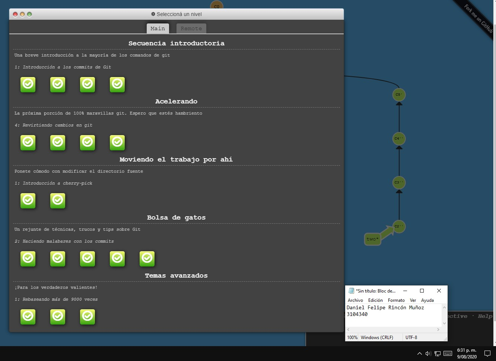
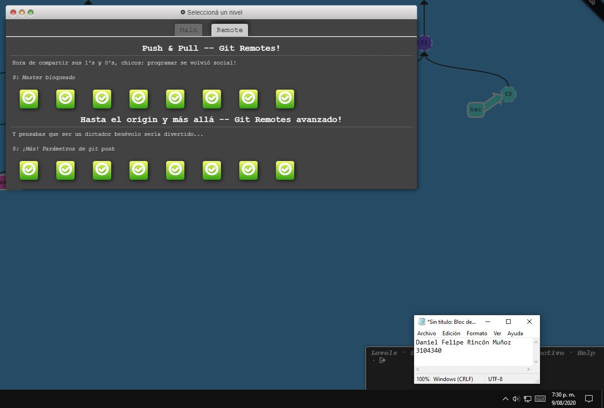

# Presentación

### Datos básicos
**Nombre:**  *Daniel Felipe Rincón*\
**N° de Carné:**  *3104340*\
**Edad:** 23

### Actividades favoritas
* [Programar](https://en.wikipedia.org/wiki/Computer_programming)
* [Tocar guitarra](https://www.youtube.com/watch?v=9upNjd4lxMQ)
* [Jugar videojuegos](https://www.ea.com/es-es/games/apex-legends)

### Carreras
- [x] Ingeniería civil
- [ ] Ingeniería de sistemas

### Primer programa
```python
def main():
	print("Hello world!")
main()
```

### Tomás


___
# GIT Branching

### Main


### Remote

